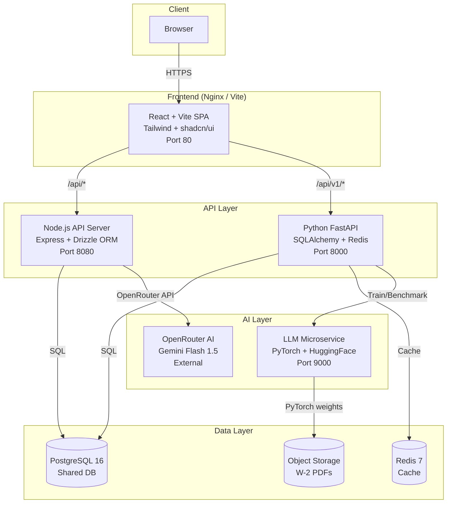
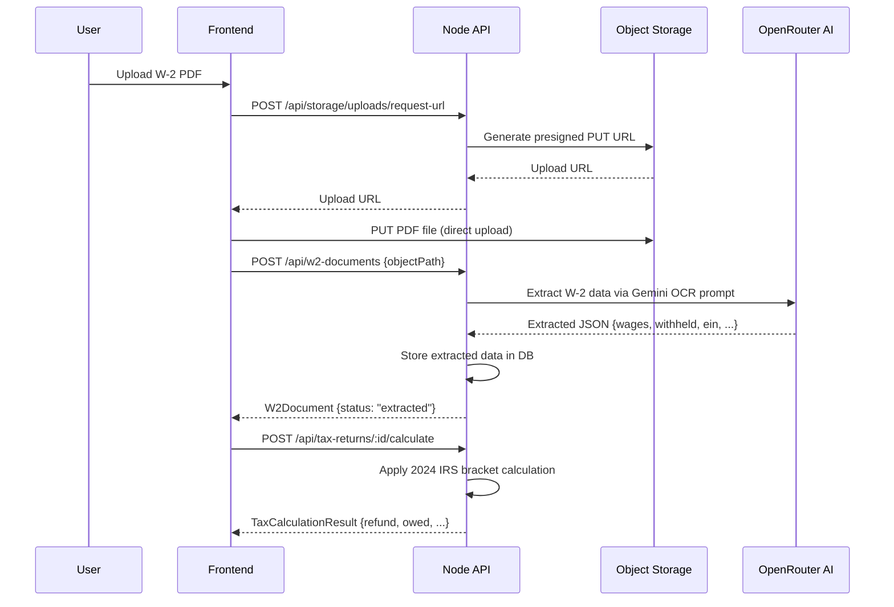
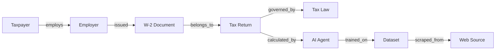
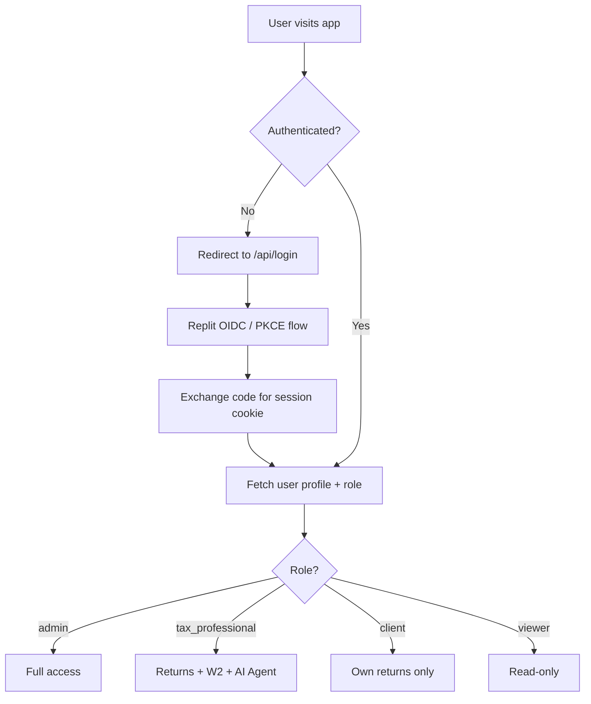
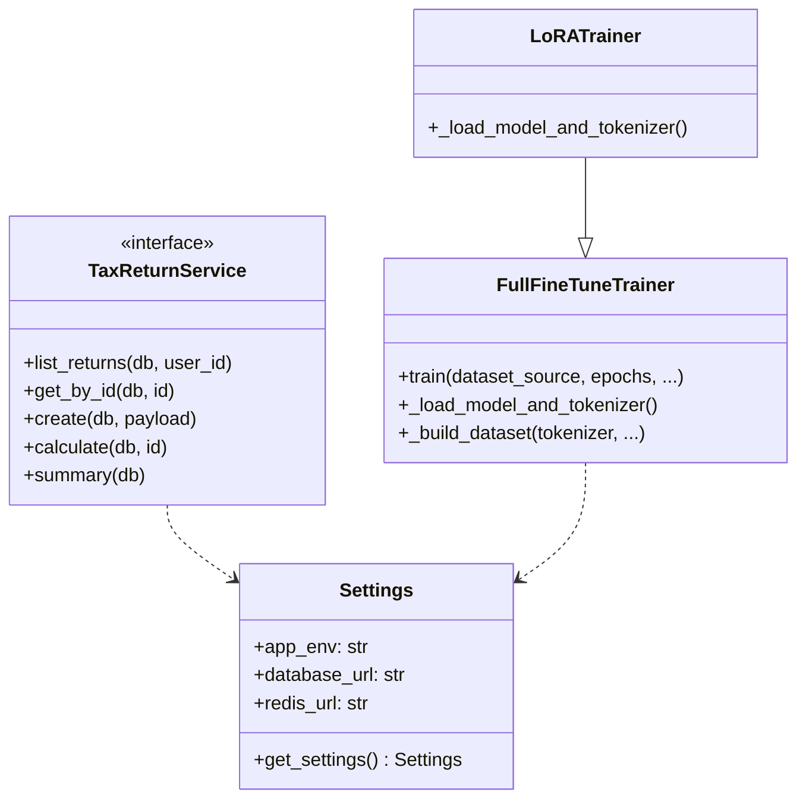

# TaxWise AI — System Architecture

## Overview

TaxWise AI is a microservice-based AI platform that automates W-2 federal tax return processing.
It is composed of four independently deployable services communicating over HTTP within a shared Docker network.

---

## High-Level Architecture

---

## Service Map

| Service | Stack | Port | Responsibility |
|---------|-------|------|---------------|
| **frontend** | React 18, Vite, Tailwind, shadcn/ui | 80 | Dashboard SPA, all user-facing pages |
| **api-server** | Node.js 24, Express, Drizzle ORM | 8080 | Auth, CRUD, tax bracket calculation, OCR |
| **python-api** | Python 3.11, FastAPI, SQLAlchemy | 8000 | LLM management, scraping, advanced analytics |
| **llm-service** | PyTorch, HuggingFace Transformers | 9000 | Model training, fine-tuning, benchmarking |
| **postgres** | PostgreSQL 16 | 5432 | Persistent storage (shared) |
| **redis** | Redis 7 | 6379 | Python API response cache |

---

## Data Flow — W-2 Processing

---

## Knowledge Graph

Nodes are coloured by type and visualised in an interactive 3D force graph (Three.js / react-force-graph-3d).

---

## Authentication & RBAC

---

## Python FastAPI — Factory Pattern

---

## Caching Strategy

| Layer | Tool | TTL | Invalidated On |
|-------|------|-----|----------------|
| Tax return list | Redis | 120s | Create / Delete |
| Dashboard summary | Redis | 300s | Create / Delete |
| Knowledge graph | Redis | 600s | Entity update |
| API responses | Redis | 300s | Mutation |

Cache is implemented via the `@cached(prefix, ttl)` Python decorator in `app/core/cache.py`.
It falls back silently to no-cache when Redis is unavailable (local dev without Docker).
